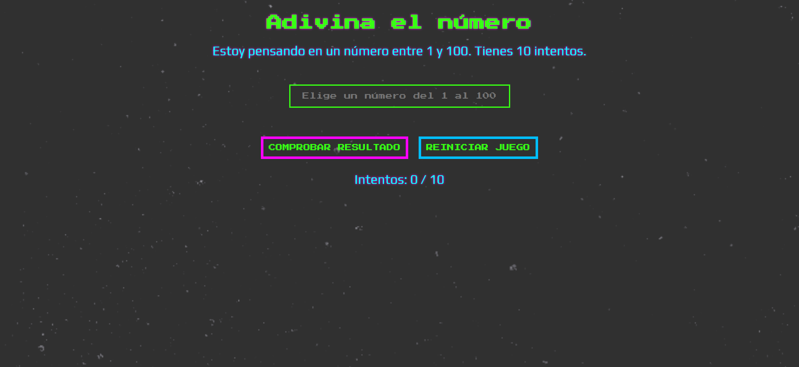

# Adivina el número

## Instrucciones

1. **Generar un número secreto**
   - Al iniciar el programa, crea un número aleatorio dentro de un rango (por ejemplo, del 1 al 10).
   - Guárdalo en una variable para poder compararlo luego.
2. **Preparar el input y botón en HTML**
   - Un `input` para que el usuario escriba el número que cree.
   - Un `button` para enviar la respuesta.
   - Un `p` o `div` para mostrar mensajes (ej: “Demasiado alto”, “Demasiado bajo”, “¡Correcto!”).
3. **Capturar el intento del usuario**
   - Al hacer clic en el botón (o presionar Enter), recoge el valor escrito en el input.
   - Convierte ese valor en número (porque por defecto llega como string).
4. **Comparar con el número secreto**
   - Si el número del usuario es igual al secreto → mostrar mensaje de éxito.
   - Si es menor → mostrar “Demasiado bajo”.
   - Si es mayor → mostrar “Demasiado alto”.
5. **Controlar el número de intentos (opcional)**
   - Lleva un contador de intentos.
   - Muestra cuántos intentos lleva.
   - Si llega a un límite (ej: 10 intentos) → mensaje de “Game Over” y termina.
6. **Finalizar o reiniciar el juego**
   - Cuando el usuario acierta o se acaba el límite de intentos, deshabilita el input/botón.
   - O bien, ofrece un botón de “Reiniciar” que genere un nuevo número secreto.

## Cómo quedaría

[Enlace a CodePen](https://codepen.io/loli-gf/pen/KwdBjqG)