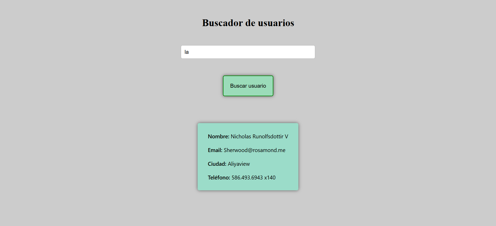

# Buscador de usuarios

Este proyecto consiste en crear una mini-app que permita buscar usuario/as y mostrar sus datos en pantalla, consumiendo una API pública.

https://jsonplaceholder.typicode.com/users

## Mejoras:

- Al buscar un user y salir el resultado, si haces click en la X del input, no desaparece la card con los datos del user.