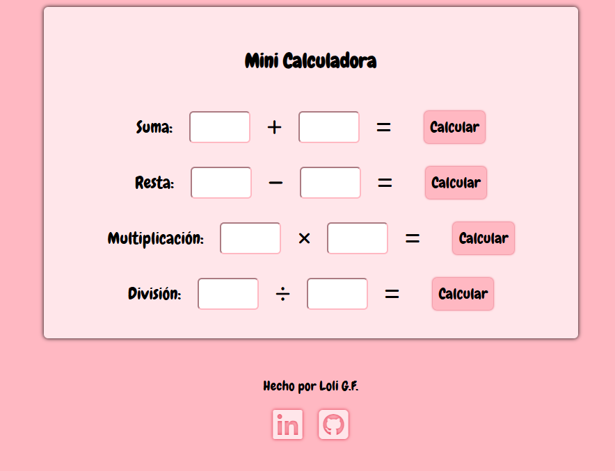

# Mini calculadora

Este proyecto consiste en crear una calculadora simple en la que se calcula cada línea.

Hay una línea para sumar, restar, multiplicar y dividir.

[Enlace al proyecto en CodePen](https://codepen.io/loli-gf/pen/azvVWxG)