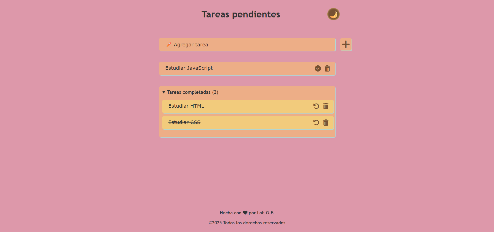
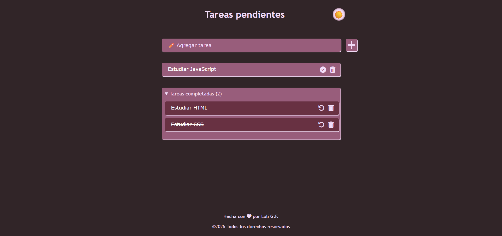

<h1>Proyecto To Do list</h1>

El proyecto consiste en crear una lista de tareas pendientes. Está creado en HTML, CSS y JavaScript.

Tiene las siguientes funcionalidades:

<ul>
<li>Botón para cambiar el tema de light a dark</li>
<li>Escribe en el input y al hacer click en el icono "+" añade la tarea</li>
<li>Aparece la tarea pendiente que puedes eliminarla o pasarla a la lista de tareas completadas</li>
<li>Hay un contador de tareas completadas</li>
<li>Puedes eliminar las tareas completadas con el icono de la basura</li>
<li>Puedes rehacer una tarea que has marcado como completada y llevarla al bloque de tarea pendiente</li>
</ul>

Como detalle, he agregado una animación para el footer. El corazón cambia de color. Además de agregar un script para que tenga en cuenta el año actual para el copyright.

<h2>Imágenes del proyecto</h2>
<h3>Light mode</h3>

<h3>Dark mode</h3>

Gracias por ver mi proyecto 💜
